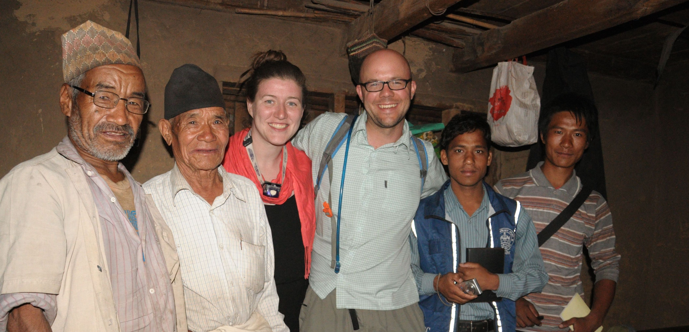

+++
# A Demo section created with the Blank widget.
# Any elements can be added in the body: https://sourcethemes.com/academic/docs/writing-markdown-latex/
# Add more sections by duplicating this file and customizing to your requirements.

widget = "blank"  # See https://sourcethemes.com/academic/docs/page-builder/
headless = true  # This file represents a page section.
active = true # Activate this widget? true/false
weight = 15  # Order that this section will appear.

title = "About Me"
subtitle = ""

[design]
  # Choose how many columns the section has. Valid values: 1 or 2.
  columns = "1"

[design.background]
  # Apply a background color, gradient, or image.
  #   Uncomment (by removing `#`) an option to apply it.
  #   Choose a light or dark text color by setting `text_color_light`.
  #   Any HTML color name or Hex value is valid.

  # Background color.
  # color = "navy"
  
  # Background gradient.
  # gradient_start = "DeepSkyBlue"
  # gradient_end = "SkyBlue"
  
  # Background image.
  image = ""  # Name of image in `static/img/`.
  #image_darken = 0.6  # Darken the image? Range 0-1 where 0 is transparent and 1 is opaque.

  # Text color (true=light or false=dark).
  text_color_light = false

[design.spacing]
  # Customize the section spacing. Order is top, right, bottom, left.
  padding = ["20px", "10%", "20px", "20%"]

[advanced]
 # Custom CSS. 
 css_style = ""
 
 # CSS class.
 css_class = ""
+++

I am a political scientist whose work lies at the intersection of the subfields of international relations and comparative politics. My scholarship examines the range of contentious politics from civil resistance campaigns to civil wars. I am especially interested in the sociological underpinnings of conflicts as well as their transnational dimensions. I focus on questions such as when and how do social groups mobilize in campaigns of political resistance? how do such movements chose between violent and nonviolent strategies? and how do social structures, state institutions, and transnational forces shape patterns of conflict? In answering these questions, I utilize a combination of qualitative and quantitative methods. This has involved conducting field research in Nepal as well as working with colleagues to create an original dataset of the ethnic composition of military forces in the Middle East and Africa.

<figure>

<figcaption>
Conducting interviews in Thabang, Nepal
</figcaption>
</figure>

My book manuscript is tentatively titled *Between Gandhi and Mao: The Social Roots of Civil Resistance.* The book investigates how challengers to state power come to embrace or reject nonviolent civil resistance as a strategy in pursuit of regime change. I have published articles in *International Studies Quarterly*, the *Journal of Global Security Studies, Conflict Management and Peace Science*, and *Small Wars and Insurgencies.* My research has been supported by the Smith Richardson Foundation, Harvard University's Program on Negotiation, the Eisenhower Institute, and the Bradley Foundation. I have provided commentary for WNIJ radio, the Australian Broadcasting Corporation's "Big Ideas" radio program, and *The Washington Post*'s "Monkey Cage" blog, among other outlets.

Currently, I am an Assistant Professor in the Department of Political Science at Northern Illinois University. I previously held research appointments at the Chicago Project on Security and Terrorism at the University of Chicago and at the Harvard Kennedy School's Belfer Center for Science and International Affairs. I received my Ph.D. from The Fletcher School of Law and Diplomacy at Tufts University and my B.A. from Middlebury College. 

Prior to entering academia, I worked as a foreign and defense policy aide in the U.S. House of Representatives, a legislative assistant in the Vermont State Senate, and a public affairs intern at the U.S. Embassy in Doha, Qatar. This background in public policy shapes my commitment to "engaged scholarship" in which academic research and teaching empower policymakers, activists, and citizens to make more informed decisions in pursuit of a more just and peaceful world.